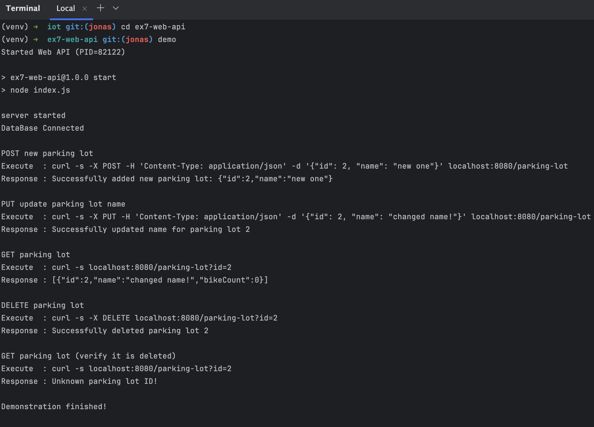

# Exercise 7 - Web API

This folder contains a sample Web API for the parking lot project.

Run with:
```shell
npm run start
```

For demonstration run the "demo" executable:
```shell
demo
```

This produces the following output:
